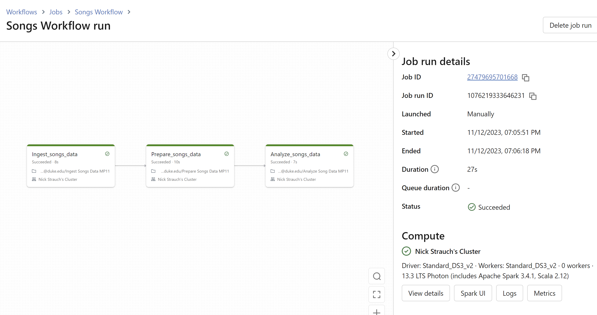

# A Databricks Data Pipeline with Azure

In this project, I used databricks to pipeline song data. My datapipeline uses a source -- sink architechure. The Injest_songs_data task loads data as the source. The Prepare-songs-data task prepares the data by loading it into a table with a predefined schema. Finally, the Analyze-songs-data task queries the data, acting as the sink at the end of the data pipeline. 
Using the Databricks notebook runtime functionality, Injest_songs_data runs in python while Prepare-songs-data and Analyze-songs-data run SQL queries.

